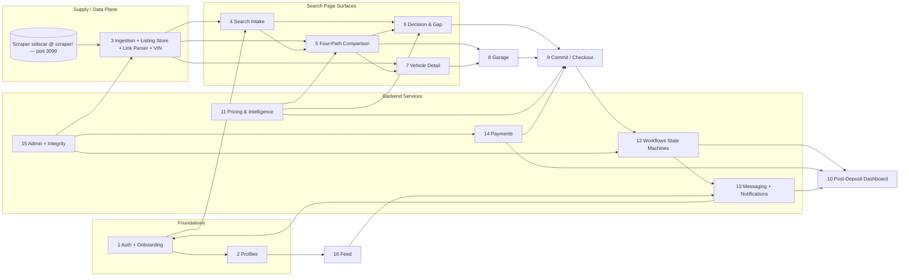

# PicknBuild Architecture

Single authoritative architecture doc for the PicknBuild product. Consolidates the `original-spec/` and `chud/` doc sets, applies `chud/DROPPED.md`, and resolves the conflicts flagged in the original-spec architecture review.

Reads alongside [COMPONENTS.md](COMPONENTS.md). Every component name mentioned here is defined there, with Inputs / Outputs / Talks-to fully specified so teams can build in parallel against stable contracts.

---

## 1. Overview

PicknBuild is a vehicle marketplace built around a **four-path comparison** (Dealer / Auction / picknbuild / Private Seller) and a **committed purchase flow** (picknbuild path only). The pre-deposit job is to help a logged-in buyer understand the real all-in cost of every path for a specific car and decide which one fits them. The post-deposit job is to execute the picknbuild contract and keep the buyer informed.

Reading order for new contributors:

1. §2 Cross-cutting rules — the laws that every team has to honor.
2. §3 Shared data contracts — the typed shapes that cross team boundaries.
3. §4 Ownership — the 16-team split and the dependency graph.
4. §5 Per-team charters — what each team owns, publishes, consumes.
5. §6 Backend contracts to stub first — the ordered unblocking list.
6. §7 Dropped items — what is explicitly out of scope, so nobody re-adds it.

How to use this doc when starting a task: find the owning team in §5, jump to the matching component row in COMPONENTS.md, implement against the published contracts without caring how other teams implement theirs.

---

## 2. Cross-cutting rules

These apply globally. Every team honors them; they override anything in a legacy spec file.

- **Auth is universal.** Every customer surface sits behind auth. No public pages. Signup requires phone-number verification.
- **Live update principle.** The search experience has no "Search" button. Any intake input change (top controls, credit, title pref, term, etc.) triggers a client-side recompute and backend refetch where needed. See also the path-card contract in §3.
- **All-in pricing.** Every price surface shows the all-in number for the given path (base + tax + fees + applicable adjustments). No hidden fees at later steps.
- **Supply is independent rows.** Every listing is a standalone `ListingObject`. **No cross-source dedup, no merge, no historical price tracking.** Supersedes `original-spec/03` and `original-spec/04.8`.
- **Supply refresh strategy.**
  1. Daily batch ingest from each source — runs from the in-tree scraper sidecar's `/ingest/run` endpoint (cron-triggered) and writes directly to the shared `listings` table.
  2. On-view refresh with cooldown — fires on detail view if `now - last_refreshed_at > cooldown`. Cooldowns are defined in `src/lib/listings/refresh.ts:REFRESH_COOLDOWN_MS`: auction 1h · craigslist 24h · firecrawl 1h · dealer-posted no auto-refresh · user/parsed-link no auto-refresh.
  3. Idle sweep marks dormant rows stale / removed.
  No real-time polling, no websocket auction feed, no full hourly sweep.
- **Scraper is in-tree.** Lives at `scraper/` and runs on port 3099 alongside Next.js. Owns Copart (Playwright), IAAI (Playwright), and Firecrawl-driven adapters (Cars.com, BaT, dealer sites). It writes `ListingObject`-shaped rows to the shared Supabase database via service-role and exposes `POST /search`, `GET /preview`, `GET /vehicle/:source/:id`, `POST /refresh/:listingId`, `GET /curated`, and `POST /ingest/run`. The Next.js app consumes these through `/api/scrape`, `/api/orch-health`, `/api/curated`, `/api/listings/[id]/refresh`. New sources are added as adapters under `scraper/src/adapters/` and registered in `scraper/src/server.ts` — the frontend never fetches external sites directly. Schema/contract changes that involve a new `source` value must be coordinated across `supabase/migrations/` (DB constraint) AND `src/contracts/listing-object.ts` (`ListingSource` union); see `KNOWN_ISSUES.md#1` for the firecrawl drift incident.
- **Dealer model.** Dealers onboard and post their own listings. **No dealer scraping. No claim flow against scraped dealer inventory.** Dealer-posted listings have `source: "dealer"` and are owned by a dealer user.
- **Location model.** ZIP captured once at onboarding, stored on the user record, never auto-updated from the header. Distance is haversine over stored ZIP centroids, cached per `(user, listing)`. No shipping estimate, no location-aware pricing.
- **Title filter behavior.** When the buyer sets "clean only" or "rebuilt only", listings whose parsed title is neither (unknown / unparsable) are hidden. When "both" (default), every listing renders regardless of parsed title. Overrides the "prioritize, don't hide" variant in `chud/01`.
- **Risk badge.** Single derivation: user credit score → low / med / high. No other inputs. Rendered wherever a path appears.
- **Best-Fit badge.** One of the four paths gets it per vehicle. Default logic: lowest total out-of-pocket for the user's credit tier. User can flip the preference to "lowest monthly," which weights picknbuild bi-weekly / Dealer APR monthly. No effort / risk / timeline inputs.
- **Auction path is DIY only.** The auction card surfaces current bid, BIN, estimated market value, fees, all-in estimate, timeline, risk. The conversion action is "go act on this listing yourself" — **no platform-run bidding, no procurement service, no $2,500 fee, no Auction Support post-deposit state**.
- **No Intelligence Layer beyond what is named here.** The four-path cards + See Where You Stand + Buying Power + Your Best Path Right Now + Pricing Guidance are the entire "help the buyer understand" surface. **No Reality Check Engine, no Dreamer/Delayer/Decider states, no What Matters Most selector, no "no dead ends" empty-state layer, no trust verification, no leaderboard/contests, no transaction inference.**

---

## 3. Shared data contracts

Every shape below crosses a team boundary. Freeze the shape early; iterate the internals without breaking consumers.

### 3.1 `ListingObject`

Every listing — auction, Craigslist, dealer-posted, user-posted, parsed-link — normalizes to this. Emitted by scrapers / ingestion / link parser; consumed by search, gap view, pricing services, guidance, detail, garage.

```
ListingObject {
  id: string
  source: "copart" | "iaai" | "craigslist" | "dealer" | "user" | "parsed-link"
  sourceUrl: string
  vin?: string
  year: number
  make: string
  model: string
  trim?: string
  mileage?: number
  titleStatus: "clean" | "rebuilt" | "unknown"
  price?: number                     // ask / sticker / cash
  currentBid?: number                // auction only
  binPrice?: number                  // auction only
  estimatedMarketValue?: number
  fees?: number                      // auction only
  photos: string[]
  locationZip?: string
  sourceUpdatedAt: ISOTimestamp
  lastRefreshedAt: ISOTimestamp
  status: "active" | "stale" | "removed"
  ownerUserId?: string               // dealer or user-posted only
}
```

Writer: Team 3. Readers: Teams 4, 5, 6, 7, 8, 9, 11, 15, 16.

### 3.2 `IntakeState`

Single source of truth for the search page. Lives client-side, persisted per user.

```
IntakeState {
  location: { zip: string }          // from user record, read-only on search
  make?: string
  model?: string
  yearRange?: [number, number]
  mileageMax?: number
  trim?: string
  cash: number
  creditScore?: number
  noCredit: boolean
  titlePreference: "clean" | "rebuilt" | "both"
  matchMode: boolean
  selectedTerm?: "cash" | "1y" | "2y" | "3y" | "4y" | "5y"   // gap-view only
}
```

Writer: Team 4. Readers: Teams 5, 6, 9, 11.

### 3.3 `BuildRecord`

Per-user, per-session record of picknbuild customizations and attachments before deposit. Persists so the configurator can hydrate from the compare page.

```
BuildRecord {
  id: string
  userId: string
  listingId?: string                 // optional anchor
  selectedPackage?: "standard" | "premium" | "silver" | "platinum" | "gold"
  customizations: {
    wrap?: boolean
    seats?: boolean
    starlight?: boolean
    paint?: boolean
  }
  attachments: { type: "link"|"file"|"image"|"note", ref: string, note?: string }[]
  alreadyHaveACar?: { vin?: string, fallback?: { year, make, model, mileage, trim }, requestedWork: string[] }
  tradeIn?: { vin: string, titleStatus: "clean"|"rebuilt", estimatedValue?: number }
  createdAt: ISOTimestamp
  updatedAt: ISOTimestamp
}
```

Writer: Team 9 (configurator) + Team 5 (from picknbuild card customization toggles). Readers: Teams 9, 11.

### 3.4 `DealRecord`

Post-deposit contract. Created on successful deposit charge; owns the Garage dashboard.

```
DealRecord {
  id: string
  userId: string
  buildRecordId: string
  listingId?: string
  committedSpec: {
    makeModelYearRange: string
    mileageRange: string
    titleType: "clean" | "rebuilt"
    customizations: string[]
    attachments: string[]
  }
  package: "standard"|"premium"|"silver"|"platinum"|"gold"
  pricing: { total: number, down: number, biweekly: number, term: "1y"|"2y"|"3y"|"4y"|"5y" }
  status: "build-started" | "sourcing" | "purchased" | "in-transit" | "delivered" | "surrendered" | "cancelled"
  timeline: { stage: string, occurredAt: ISOTimestamp }[]
  agreementId: string
  createdAt: ISOTimestamp
}
```

Writer: Team 12 (state machine) + Team 14 (on deposit success). Readers: Teams 10, 15.

### 3.5 `AgreementDocument`

Signed commitment stored alongside the deal.

```
AgreementDocument {
  id: string
  userId: string
  buildRecordId: string
  renderedSpecSummary: string        // what the user saw on screen
  clauses: string[]                  // path-specific clause ids
  signaturePayload: { image: string, signedAt: ISOTimestamp, ip: string }
  nonRefundableAcknowledged: true
  insuranceAcknowledged: true
  pdfUrl: string
}
```

Writer: Team 9. Readers: Teams 10, 12, 14, 15.

### 3.6 `ConversionState`

Per `(userId, listingId)` state machine tracking the move from decision to post-deposit.

```
ConversionState = "decided" | "payment-initiated" | "deposit-received" | "post-deposit"
```

Writer: Team 12. Readers: Teams 5 (CTAs), 9 (checkout gating), 10 (garage status views), 14 (charge side effects).

### 3.7 `User`

```
User {
  id: string
  role: "buyer" | "dealer" | "seller" | "admin"
  phone: string                      // verified at signup
  email?: string
  displayName?: string
  zip: string                        // captured at onboarding, not auto-updated
  budget?: number
  creditScore?: number
  noCredit?: boolean
  preferences: { bestFit: "lowestTotal" | "lowestMonthly", notifChannels: string[] }
  createdAt: ISOTimestamp
}
```

Writer: Team 1 (auth + onboarding). Readers: all teams.

### 3.8 `Notification`

```
Notification {
  id: string
  userId: string
  category: "message" | "price-change" | "dealer-response" | "payment" | "deal-status" | "system"
  payload: unknown                   // category-specific
  channel: "in-app" | "email" | "digest"
  createdAt: ISOTimestamp
  readAt?: ISOTimestamp
}
```

Writer: Team 13. Readers: Team 1 (shell bell), Team 10 (dashboard), Team 13 (history).

### 3.9 `MessageThread`

```
MessageThread {
  id: string
  participants: string[]             // userIds
  kind: "buyer-seller" | "buyer-dealer" | "buyer-picknbuild"
  listingId?: string
  lastMessageAt: ISOTimestamp
}

Message {
  id: string
  threadId: string
  senderId: string
  body: string
  attachments?: string[]
  sentAt: ISOTimestamp
}
```

Writer + transport: Team 13. Readers: Team 1 (shell entry), Team 10 (deal-linked threads).

### 3.10 `PaymentRecord`

```
PaymentRecord {
  id: string
  userId: string
  kind: "deposit" | "subscription" | "lead-unlock" | "listing-fee" | "refund" | "balance"
  amount: number
  currency: "USD"
  stripeRef: string
  status: "pending" | "succeeded" | "failed" | "refunded"
  dealId?: string
  createdAt: ISOTimestamp
}
```

Writer: Team 14. Readers: Team 10 (history), Team 15 (ledger).

### 3.11 Pricing service response (all paths)

Every pricing-service call returns this uniform shape so path cards and gap modules can render identically.

```
PathQuote {
  path: "dealer" | "auction" | "picknbuild" | "private"
  total: number                      // all-in, including tax/fees/customizations/trade-in
  down?: number
  monthly?: number                   // dealer only
  biweekly?: number                  // picknbuild only
  apr?: number                       // dealer only
  term?: "cash" | "1y" | ... | "5y"
  approvedBool?: boolean             // false for Dealer when credit tier fails
  barrierLine: string                // one-line "what this path really requires"
  titleStatus: "clean" | "rebuilt" | "unknown"
}
```

Writer: Team 11. Readers: Teams 5, 6, 9.

---

## 4. Ownership boundaries



### The 16 teams

| # | Team | One-paragraph charter |
|---|------|----------------------|
| 1 | **Foundations** | Auth (phone-verified signup), onboarding wizard, `User` record, global shell (header + mobile nav + responsive framework), legal-disclaimer copy library. Unblocks every other team by publishing the `User` contract and the app shell. |
| 2 | **Profiles** | Buyer / Dealer / Individual-Seller profile views plus the Dealer Page Edit Panel (where dealers post / edit / remove listings). Owns none of the listing data (that's Team 3); owns the view surfaces and the dealer's authoring UI. |
| 3 | **Supply / Data Plane** | Ingestion writer that normalizes scraper output into `ListingObject`, the listing store, the on-view refresh service with cooldowns, the idle-sweep job, the Link Parser service (URL → ListingObject), the VIN lookup service, the user-generated listing upload. **The scraper sidecar at `scraper/` (port 3099) writes rows here directly via service-role; this team owns the proxy + normalize boundary, the scraper team owns adapter internals.** |
| 4 | **Search Intake** | Top Controls bar, credit input + No-Credit toggle, clean/rebuilt toggle + tooltip, filter persistence, Match Mode UI, "Already Found a Car?" input with manual fallback. Owns the `IntakeState` client contract. |
| 5 | **Four-Path Comparison** | The four path cards (Dealer, Auction, picknbuild, Private Seller), the path comparison row, title badge, risk badge, best-fit badge, and the per-path sponsor boards. Renders `PathQuote` responses from Team 11. |
| 6 | **Decision & Gap** | Your Best Path Right Now card, See Where You Stand panel, path toggle + auto-cycle, Choose Your Term selector, per-path gap modules, Barrier-to-Entry line, Buying Power layer + visualization. |
| 7 | **Vehicle Detail** | Vehicle Detail View, All-Paths Display, Available Actions bar, Comments/Replies section, Vehicle Card / Summary Card (the shared card reused across surfaces). |
| 8 | **Garage** | Garage container, grouping by YMM, Garage Item Card, Comparison Table, decision highlight badges, action buttons, pass/pick interface, garage filter integration. Post-save / pre-commit only. |
| 9 | **Commit / Checkout** | picknbuild Configurator page, Package cards, Live Price Panel, customization toggles, Add-to-Build attachments, Spec-based commitment summary, Agreement form, Digital signature capture, Deposit checkout ($1,000 Stripe), Insurance-required + Non-refundable notices. |
| 10 | **Post-Deposit Dashboard** | Customer dashboard, status timeline, payment history view, wire instructions display, Upgrade / Downgrade / Voluntary-Surrender request flows, per-path post-conversion status views. |
| 11 | **Pricing & Intelligence Backend** | Credit-tiered down-payment resolver, picknbuild total-price formula, bi-weekly + term-to-cadence resolvers, Dealer APR tier logic, Trade-In value service, Already-Have-a-Car estimator, Recommendation engine (Your Best Path Right Now), Pricing Guidance service, Inspection Partner routing, Match Mode matching engine. |
| 12 | **Workflows Backend** | Two-step conversion state machine, post-deposit "Build Started" workflow, dealer-lead external signal flow, private-seller invite external signal flow. Owns `ConversionState` + `DealRecord.status`. |
| 13 | **Messaging + Notifications** | Socket transport, inbox + thread UI, message history, three chat kinds (buyer↔seller, buyer↔dealer, buyer↔picknbuild), Notification Service, preferences storage, bell + toasts + badge + history, email digest. |
| 14 | **Payments Backend** | Stripe integration (charges / refunds / subscriptions), subscription lifecycle, refund/deposit reconciliation, failed-payment recovery, dealer subscription + lead-unlock + per-listing fee flows, payment processing UI, receipts, refund + subscription status displays. |
| 15 | **Admin + Integrity** | Admin Dashboard (users, listings, feed, active deals, payment log, dealer subs, ingestion health, moderation), system logging, monitoring dashboard, data-privacy controls backend, secure storage layer. Thin team; mostly a read-only operator UI plus integrity primitives. |
| 16 | **Feed** | Feed surface, post templates (deal / problem / question / build / recommendation / warning), engagement controls, vehicle card in feed, profile link, media upload, clustering hook (stub is fine in v1). |

Concurrency goal: with the §6 contracts stubbed, Teams 4–10 and Team 16 build against fixtures; Teams 11–14 fill services behind those contracts; Team 15 reads whatever the other teams write.

---

## 5. Per-team charters

Each charter names owned components (→ COMPONENTS.md rows), contracts published, contracts consumed, and parallel-build expectations.

### Team 1 — Foundations

- **Owns:** Auth Service · Onboarding Wizard · User Record · Global Shell · Mobile Navigation Bar · Responsive Design Framework · Legal Disclaimer Library.
- **Publishes:** `User` contract (3.7); shell mount points (where bell, nav, inbox entry render); `requireAuth` gate used by every route.
- **Consumes:** Notification bell count from Team 13; Messaging inbox entry from Team 13.
- **Parallel expectation:** First team to finish. Every other team depends on `User` + the shell mount points. Ship stubs on day one.

### Team 2 — Profiles

- **Owns:** Buyer Profile View · Dealer Profile / Page · Dealer Page Edit Panel · Individual Seller Profile.
- **Publishes:** Dealer Page Edit Panel is the authoring surface that writes dealer-owned `ListingObject` rows (via Team 3 API).
- **Consumes:** `User` (Team 1); `ListingObject` list by `ownerUserId` (Team 3) for "active listings" on dealer/seller pages; `MessageThread` quick-open (Team 13).
- **Parallel expectation:** Build against User + Listing fixtures immediately; swap real endpoints when Teams 1 and 3 publish.

### Team 3 — Supply / Data Plane

- **Owns:** Ingestion Normalizer · ListingObject Store · On-View Refresh Service · Idle Sweep Service · Link Parser Service · VIN Lookup Service · User-Generated Listing Upload · Dealer-Posted Listing Form (UI mounted in Team 2's Dealer Edit Panel; logic is ours).
- **Publishes:** `ListingObject` contract (3.1); REST endpoints for list / get / refresh / parse-link / vin-lookup.
- **Consumes:** Output from the in-tree scraper sidecar at `scraper/` (port 3099) — the orchestrator emits `Vehicle`-shaped scored rows that map to `ListingObject` via `scraper/src/core/orchestrator.ts:persistResults` writing into the shared `listings` table. Treat already-shaped rows as canonical; normalize anything that arrives via a different path (manual upload, link parser fallback). `User.id` as `ownerUserId` (Team 1).
- **Parallel expectation:** Ship read-only fixtures first so Teams 4–8 can render. Writes (dealer-posted, user-posted, link parser) land later.

### Team 4 — Search Intake

- **Owns:** Top Controls Bar · Credit Score Input + No-Credit toggle · picknbuild Down Payment tier table (reference card) · Clean/Rebuilt preference toggle · "What is Clean vs Rebuilt?" tooltip · Title Preference Filter · Filter Persistence Indicator · Match Mode toggle · "Already Found a Car?" link parser input · Manual fallback entry · Search/Filter Control Panel.
- **Publishes:** `IntakeState` (3.2) — lives in a client store other Search teams subscribe to.
- **Consumes:** `User.creditScore`, `User.zip`, `User.preferences` (Team 1); Link Parser endpoint (Team 3); Match Mode matching engine (Team 11).
- **Parallel expectation:** Fully buildable against in-memory state. Only the "Already Found a Car?" link and Match Mode require real backend.

### Team 5 — Four-Path Comparison

- **Owns:** Four-path comparison display container · Dealer Path Card · Auction Path Card · picknbuild Path Card · Private Seller Path Card · Path Comparison Row · Title Badge · Risk Badge · Best-Fit Badge · Path-specific Sponsor Board · picknbuild Customization toggles (on card) · Trade-In flow entry · Already-Have-a-Car entry.
- **Publishes:** `select(path)` click events into Team 12's conversion state machine.
- **Consumes:** `ListingObject` (Team 3); `IntakeState` (Team 4); `PathQuote` (3.11) from pricing services (Team 11); Trade-In / Already-Have-a-Car services (Team 11); Sponsor catalog (Team 15); `BuildRecord` writes for customization toggles (Team 9 owns the model).
- **Parallel expectation:** Render against `PathQuote` fixtures until Team 11 ships.

### Team 6 — Decision & Gap

- **Owns:** Your Best Path Right Now card · See Where You Stand panel · Path toggle inside gap view · Auto-cycle behavior · Choose Your Term selector · Dealer / picknbuild / Auction / Private gap-logic modules · Barrier to Entry line · Buying Power layer · Buying Power visualization bar.
- **Publishes:** Nothing outbound beyond UI; writes `IntakeState.selectedTerm` through Team 4's store.
- **Consumes:** `IntakeState` (Team 4); `PathQuote` (Team 11); Recommendation engine response (Team 11).
- **Parallel expectation:** Buying Power is pure client math; everything else is a render over Team 11 responses.

### Team 7 — Vehicle Detail

- **Owns:** Vehicle Detail View · All Acquisition Paths Display · Available Actions Bar · Comments / Replies Section · Distance Display · Down Payment Display · Vehicle Card / Summary Card (the shared card reused across surfaces).
- **Publishes:** Vehicle Card / Summary Card as a reusable component (used by Teams 5, 8, 16).
- **Consumes:** `ListingObject` (Team 3); `PathQuote` (Team 11); MessageThread open (Team 13); ConversionState CTAs (Team 12); Comments API (thin; owned here but persisted via Team 15's secure storage).
- **Parallel expectation:** Can ship with Team 5's card shapes as the source of truth for the "all paths" rendering.

### Team 8 — Garage

- **Owns:** Garage View / Container · Vehicle Grouping Display · Garage Item Card · Comparison Table · Decision Highlight Badges · Action Buttons (start picknbuild / talk / contact dealer / message seller / compare all paths) · Pass/Pick Decision Interface · Garage Filter Integration.
- **Publishes:** Saved-vehicle set per user (persisted via Team 15 storage).
- **Consumes:** `ListingObject` (Team 3); `IntakeState` filters (Team 4); `PathQuote` (Team 11); ConversionState CTA entry (Team 12); Messaging open (Team 13).
- **Parallel expectation:** Mirrors Team 5's data needs — same fixtures unlock it.

### Team 9 — Commit / Checkout

- **Owns:** picknbuild Configurator page · Package cards (5) · "What Your Package Includes" disclosure · Live Price Panel · picknbuild Customization options (Wrap / Seats / Starlight / Paint) · "Add to Your Build" attachments · Spec-based Commitment Summary · Agreement Form · Digital Signature Capture · Deposit Checkout ($1,000 Stripe) · Insurance-required notice · Non-refundable conditions notice.
- **Publishes:** `BuildRecord` (3.3); `AgreementDocument` (3.5); deposit-checkout-initiated event to Team 12 + Team 14.
- **Consumes:** `IntakeState` (Team 4); picknbuild pricing service (Team 11); Stripe deposit flow (Team 14); ConversionState transitions (Team 12).
- **Parallel expectation:** All UI + state buildable against pricing fixtures; real Stripe lands when Team 14 exposes its charge endpoint.

### Team 10 — Post-Deposit Dashboard

- **Owns:** Customer dashboard · Status timeline · Payment history view · Wire instructions display · Upgrade / Downgrade / Voluntary-Surrender request flows · Post-conversion status views per path.
- **Publishes:** Upgrade/Downgrade/Surrender request events → Team 12 + Team 15 admin queue.
- **Consumes:** `DealRecord` (Team 12); `PaymentRecord` (Team 14); wire instructions generator (Team 14); `MessageThread` list (Team 13); `ConversionState` (Team 12).
- **Parallel expectation:** Dashboard shell renders from `DealRecord` fixtures immediately; side flows plug in as Teams 12/14 land.

### Team 11 — Pricing & Intelligence Backend

- **Owns:** Credit-tiered down-payment resolver · picknbuild total-price formula · Bi-weekly payment calculation · Term-to-cadence resolver (1–5 yr → 26/52/78/104/130 biweekly payments) · Dealer APR tier logic (12% / 19.5% / 27%) · Trade-In value service · Already-Have-a-Car estimator · Recommendation engine (Your Best Path Right Now) · Pricing Guidance service · Inspection Partner routing service · Match Mode matching engine.
- **Publishes:** `PathQuote` (3.11) per-path endpoints; recommendation endpoint returning `{recommendedPath, reason, supportingBullets, alternatives, primaryCta}`; guidance endpoint returning `{verdict, reasonLine, marketRange?, negotiationAnchor?}`; inspection request / result endpoints.
- **Consumes:** `ListingObject` (Team 3); `IntakeState` (Team 4); `User.creditScore` (Team 1); VIN lookup (Team 3).
- **Parallel expectation:** Publishes response fixtures on day one. Real math fills in gradually, shape stays stable.

### Team 12 — Workflows Backend

- **Owns:** Two-step conversion state machine · Post-deposit "Build Started" workflow · External signal flow (dealer lead) · External signal flow (private seller invite).
- **Publishes:** `ConversionState` (3.6); `DealRecord` creation on `deposit-received`; dealer-lead / seller-invite events into Team 13's notification fan-out.
- **Consumes:** Deposit-success event (Team 14); path-CTA events (Teams 5, 8); `AgreementDocument` (Team 9); `BuildRecord` (Team 9).
- **Parallel expectation:** State machine stubs transition on faked deposit events — unblocks Team 10 immediately.

### Team 13 — Messaging + Notifications

- **Owns:** Socket transport · Message Inbox · Chat Window / Thread · Message History · Buyer↔Seller / Buyer↔Dealer / Buyer↔picknbuild chats · Notification Service · Notification Preferences Storage · Notification Center (bell) · Badge/Counter · In-App Toasts · Notification History · Email Digest · Notification Preferences Panel.
- **Publishes:** `MessageThread` (3.9); `Notification` (3.8); bell count + toast events into Team 1's shell.
- **Consumes:** `User` (Team 1); workflow events (Team 12); payment events (Team 14); deal-status events (Team 12).
- **Parallel expectation:** Inbox + bell UI usable against fixtures; socket + email digest land when backend is up.

### Team 14 — Payments Backend

- **Owns:** Stripe integration (charges / refunds / subscriptions) · Subscription Lifecycle Service · Refund / Deposit Reconciliation Service · Failed Payment Recovery Service · Payment tracking system · Lead Unlock Purchase Interface · Dealer Subscription Management Panel · Listing Price Modal · Payment Processing Interface · Payment Receipt / Confirmation · Refund Status Display · Subscription Status Display.
- **Publishes:** `PaymentRecord` (3.10); deposit-success event to Team 12; wire instructions generator.
- **Consumes:** `User` (Team 1); `BuildRecord` (Team 9) for deposit context; `DealRecord` (Team 12) for balance payments.
- **Parallel expectation:** Stripe-sandbox deposit flow is the first milestone — unblocks Teams 9, 10, 12.

### Team 15 — Admin + Integrity

- **Owns:** Admin Dashboard · Users View · Listings Inventory View · Feed Activity Monitor · Active Deals Tracker · Payment Activity Log · Dealer Subscriptions Manager · Inventory Ingestion Health Monitor · Manual Moderation Actions · System Logging Interface · Monitoring Dashboard · Data Privacy Controls Backend · Secure Storage Layer · Sponsor Catalog.
- **Publishes:** Secure Storage Layer used by Teams 7 (comments), 8 (saved-vehicle set), 9 (agreements), 13 (messages), 14 (payments). Sponsor catalog endpoint consumed by Team 5.
- **Consumes:** Every `*Record` and every log stream from every other team.
- **Parallel expectation:** Thin. Build the Admin Dashboard against the same fixtures everyone else uses.

### Team 16 — Feed

- **Owns:** Feed View · Feed Post Card · Deal / Problem / Question / Build / Recommendation / Warning post templates · Feed Engagement Controls · User Vehicle Upload Form (shared with Team 3) · Vehicle Card in Feed (consumes Team 7's Vehicle Card) · Profile Link from Feed Post · Media Upload Interface · Feed Clustering (stub in v1).
- **Publishes:** Feed posts (persisted via Team 15 storage).
- **Consumes:** `User` (Team 1); `ListingObject` (Team 3); Vehicle Card (Team 7); Profile links (Team 2); Notification triggers (Team 13).
- **Parallel expectation:** Optional for v1 launch; not blocking other teams.

---

## 6. Backend contracts to stub first

Order matters — each entry unblocks downstream work:

1. **`User`** (Team 1) — needed by literally every surface.
2. **`ListingObject`** store + read API (Team 3) — needed by Search, Garage, Vehicle Detail, Feed.
3. **`IntakeState`** shape (Team 4) — client contract; freeze the fields so Teams 5, 6, 9, 11 can code against it.
4. **`PathQuote`** response shape (Team 11) — one shape per path card and per gap module; Teams 5 and 6 are blocked on this.
5. **`ConversionState`** enum + transitions (Team 12) — Teams 5, 9, 10 all render from it.
6. **`BuildRecord`** + **`AgreementDocument`** schemas (Team 9) — Team 14 needs them for deposit context; Team 12 needs them for state-machine input.
7. **`DealRecord`** schema (Team 12) — Team 10 is blocked on this.
8. **`Notification`** categories + fan-out shape (Team 13) — Teams 1, 10 render it; Teams 12 and 14 emit it.
9. **`PaymentRecord`** + deposit-success event (Team 14) — Team 12 subscribes to it.

If any front-of-house team finds it needs a contract not on this list, the list is incomplete — update it before branching wide.

---

## 7. Dropped items

Not in scope. Listed so nobody re-adds them without revisiting the decision. Full reasoning lives in `chud/DROPPED.md` and the architecture-review section of the old `original-spec/COMPONENTS.md`.

**From `chud/DROPPED.md`:**
- Dreamer / Delayer / Decider user-state classification.
- Empty-state "no dead ends" estimated-paths layer.
- "What Matters Most" priority selector + the dependent "See Cars You Can Get Today" CTA.
- Katzkin seat customization integration (Seats stays as a simple picknbuild toggle; specifics go through Add-to-Build).
- "Build Your Deal" interactive calculator (See Where You Stand does the same job).
- Paid Auction Service (platform-run bidding, $2,500 fee, "Auction Support Started" state) — the Auction path is DIY comparison only.

**From the `original-spec` architecture review (doc 11, 18, 21, 23, 24, parts of 03/04):**
- Reality Check Engine / true-total-cost / effort / timeline / "better for you" intelligence.
- Leaderboard + contests.
- Transaction tracking / outcome inference.
- Trust verification (badges, trust scores).
- Empty-state recovery surface (same cut as the chud DROPPED item above).
- Duplicate detection across sources; historical price tracking per VIN.
- Dealer scraping; dealer claim flow on scraped inventory.
- Dealer credit estimator.
- Shipping estimate; location-aware pricing.
- Invite / referral system; urgency filter as a first-class intake field (urgency can still influence recommendation copy internally — it's not a UI control).
- PicknBuild delivery as a separately-modeled service (it's a stage inside the post-deposit workflow, not its own product).
- External-link paste "Found a Better Deal" marketed as a separate feature (the same capability is the Link Parser in Team 3).
- Reporting / moderation queue (Team 15 does ad-hoc manual moderation only).

If a user story seems to demand a dropped item, talk to the architecture owner before building — usually the job can be done with a component already in scope.
